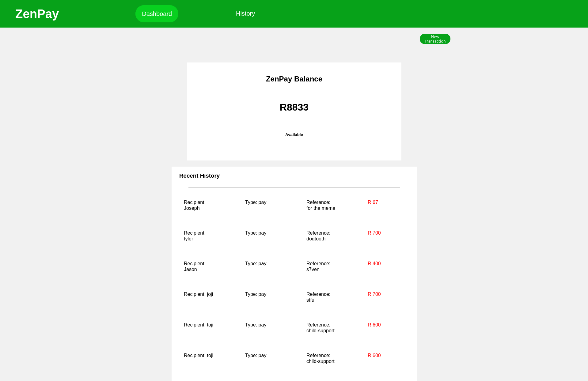
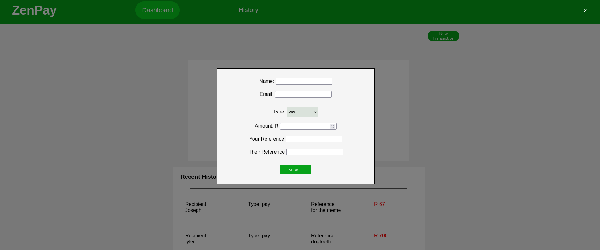
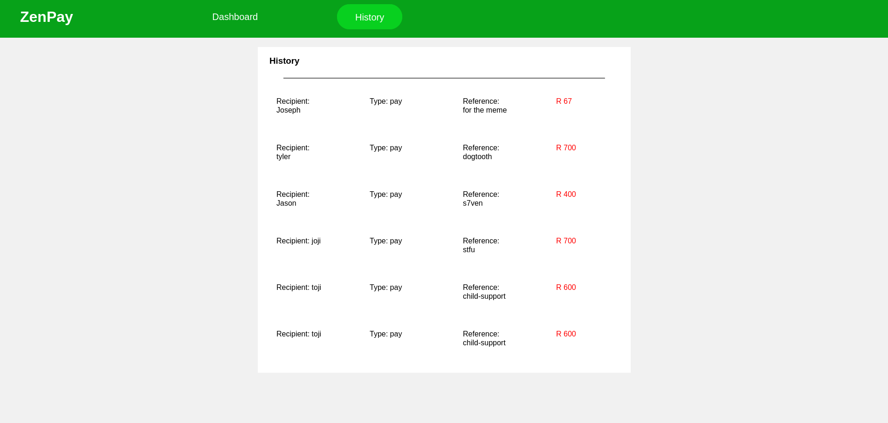
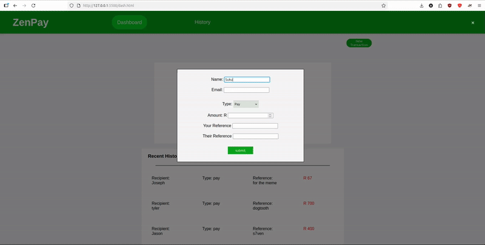

# ZenPay, a stupidly simple way to send and request(and hopefully receive) cash...emphasis on stupid though

# FAQs

### Great UX Design? 
Nope, I'm not a Soy Latte drinking, Sunset lovers.

### Did you use the latest, cutting edge, blazingly fast JS framework?
No, I just used HTML, CSS and JavaScript. I am big beginner, big noob. Noob use bone knife before marble knife.

### Is it practical or does it just work as a Proof of Concept?
Yes.

### What do you use to store your financial data?
Local Storage, it's the superior option. Next question.

### Is your database secure?
Huh?

### Are there timestamps to track transactions in case of fraud?
Me no understand, me want different question.

### Are there anti-fraud/risk management mechanics?
Those are big words buddy, let's move this along.

### What inspired you to make this?
I don't have a PS5/gaming PC. It was this project or staring at paint dry on a wall...or reading the ingredients off of a chocolate cookie box.

### TODO (NOT IN ANY PARTICULAR ORDER)
1. Watch video on DOM Manipulation, as I have literally just been googling and failing my way forward, which is a painfully slow process.  ✅ Done...it felt like pulling my teeth out(17/09/2025)
2. Create an event listener for the transaction form submit button. ✅ Done! (12/09/2025)
3. Connect the information in the transaction form to the submit button. ✅ Done! (16/09/2025)
4. Have that information be updated in the 'Recent History' section of the Dash page. ✅ Done! It was a serious pain I will not lie. (04/10/2025)
5. Have that information be updated in the 'History' section of the History page.
6. Add a visibility option for the password. ✅ Done! (13/09/2025)
7. Watch a video on LocalStorage so that I can achieve TODO sections 4 and 3. ✅ Done! The video was too boring so I had to use Qwen and w3schools (19/09/2025)
8. Store the info succesively  ✅ Done! (22/09/2025)
9. Have the transactions actually affect the amount of money in my balance ✅ Done! (08/10/2025)

# Project Complete (13/10/2025)

### Screenshots & Demo

### Dash Board

### Transaction Form

### History Page

### Demo
